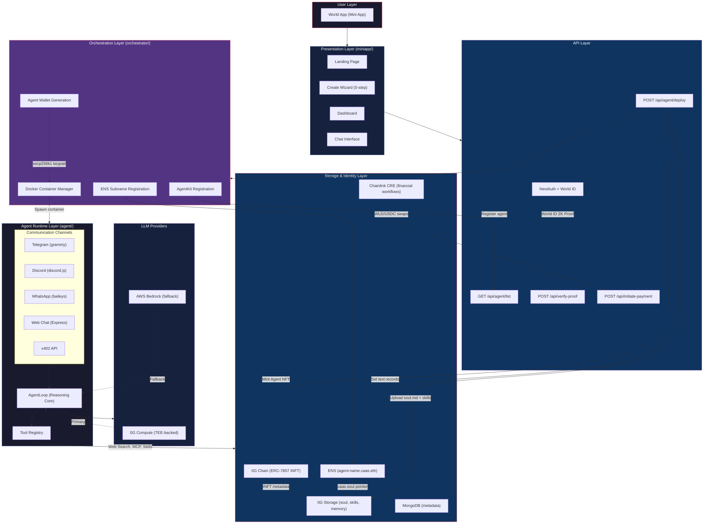
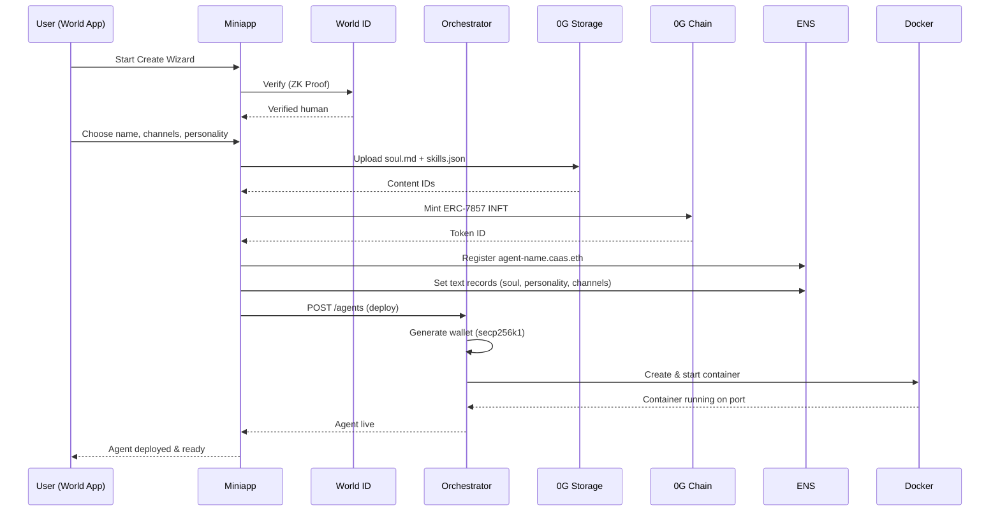
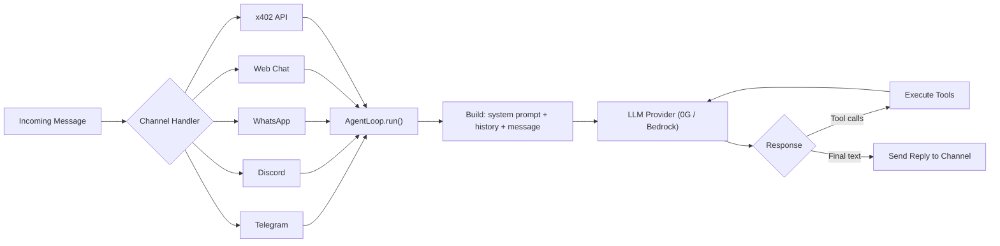

## Create a Mini App

[Mini apps](https://docs.worldcoin.org/mini-apps) enable third-party developers to create native-like applications within World App.

This template is a way for you to quickly get started with authentication and examples of some of the trickier commands.

## Getting Started

1. cp .env.example .env.local
2. Follow the instructions in the .env.local file
3. Run `npm run dev`
4. Run `ngrok http 3000`
5. Run `npx auth secret` to update the `AUTH_SECRET` in the .env.local file
6. Add your domain to the `allowedDevOrigins` in the next.config.ts file.
7. [For Testing] If you're using a proxy like ngrok, you need to update the `AUTH_URL` in the .env.local file to your ngrok url.
8. Continue to developer.worldcoin.org and make sure your app is connected to the right ngrok url
9. [Optional] For Verify and Send Transaction to work you need to do some more setup in the dev portal. The steps are outlined in the respective component files.

## Authentication

This starter kit uses [Minikit's](https://github.com/worldcoin/minikit-js) wallet auth to authenticate users, and [next-auth](https://authjs.dev/getting-started) to manage sessions.

## UI Library

This starter kit uses [Mini Apps UI Kit](https://github.com/worldcoin/mini-apps-ui-kit) to style the app. We recommend using the UI kit to make sure you are compliant with [World App's design system](https://docs.world.org/mini-apps/design/app-guidelines).

## Eruda

[Eruda](https://github.com/liriliri/eruda) is a tool that allows you to inspect the console while building as a mini app. You should disable this in production.

## Architecture

### Agent Creation Flow

### Agent Message Processing

## Contributing

This template was made with help from the amazing [supercorp-ai](https://github.com/supercorp-ai) team.